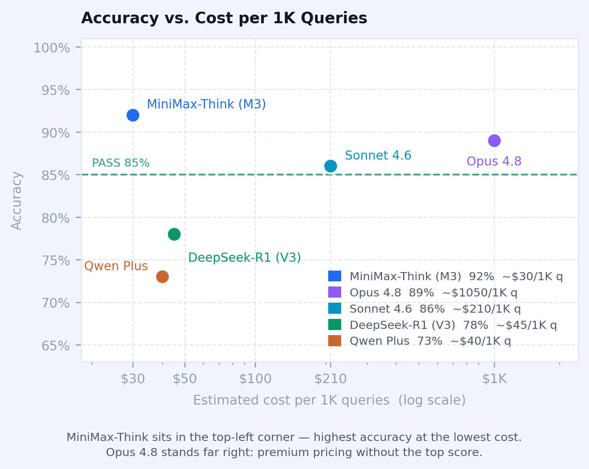
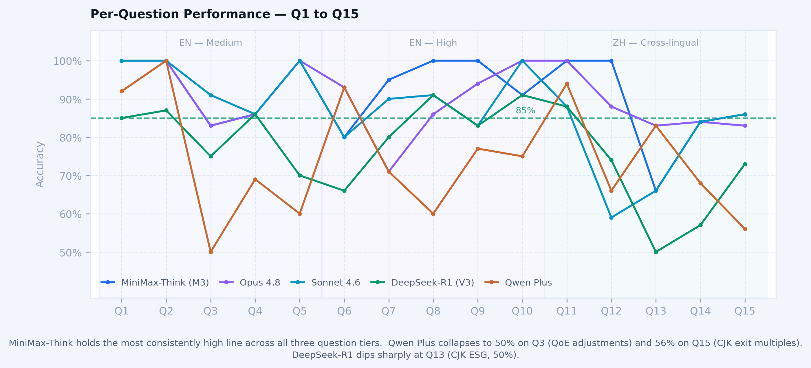

# AquaFlow LLM Query Benchmark

**Wiki:** AquaFlow Systems PE/M&A due diligence  
**Date:** 2026-07-09 / 2026-07-10 / 2026-07-10  
**Evaluator:** `docs/example/aquaflow/evaluation/scripts/eval_queries.py`

---

## Table of Contents

- [Overview](#overview)
- [Models Evaluated](#models-evaluated)
- [Summary Leaderboard](#summary-leaderboard)
- [Question Reference](#question-reference)
- [Per-Question Results](#per-question-results)
  - [MiniMax-Think (M3)](#minimax-think-m3)
  - [Claude Opus 4.8](#claude-opus-48)
  - [Claude Sonnet 4.6](#claude-sonnet-46)
  - [DeepSeek-R1 (V3)](#deepseek-r1-v3)
  - [Qwen Plus](#qwen-plus)
- [Cross-Model Comparison](#cross-model-comparison)
- [WARN Analysis](#warn-analysis)
- [System Health Notes](#system-health-notes)
- [Conclusion](#conclusion)

---

## Overview

This report benchmarks five LLMs against 15 PE/M&A due diligence questions drawn from the
[AquaFlow wiki](../../README.md). Questions Q1–Q10 are in English; Q11–Q15 are in Mandarin
Chinese. Each answer is scored by case-insensitive substring match against a curated fact list
(282 facts total; defined per-question in [`eval_queries.py`](../scripts/eval_queries.py)).
Grading follows a two-tier framework:

| Grade | Threshold | Meaning |
|-------|-----------|---------|
| **PASS** | ≥ 85% facts matched | System and model performing correctly |
| **WARN** | < 85% facts matched | Model-level or non-deterministic limitation — not a system bug |

`FAIL` is reserved exclusively for confirmed system or code bugs; none were found in this run.

The questions span three complexity tiers as defined in the [AquaFlow README](../../README.md):

- **English medium complexity** (Q1–Q5): single-workstream recall, specific figures
- **English high complexity** (Q6–Q10): cross-workstream synthesis across 5–7 wiki pages
- **Chinese cross-lingual** (Q11–Q15): CJK queries against English-language wiki pages,
  answered in Chinese via character-level BM25 retrieval with no separate translation index

---

## Models Evaluated

| Label | Provider | Model ID | Config | Run timestamp |
|-------|----------|----------|--------|---------------|
| MiniMax-Think (M3) | MiniMax | MiniMax-M3 | thinking=enabled | 2026-07-09 20:23 |
| Claude Opus 4.8 | Anthropic | claude-opus-4-8 | — | 2026-07-10 11:14 |
| Claude Sonnet 4.6 | Anthropic | claude-sonnet-4-6 | — | 2026-07-09 20:26 |
| DeepSeek-R1 (V3) | DeepSeek | deepseek-reasoner | chain-of-thought | 2026-07-09 19:50 |
| Qwen Plus | Alibaba / DashScope | qwen-plus → qwen-plus-2025-12-01 (Qwen 3) | — | 2026-07-10 12:00 |

---

## Summary Leaderboard

| Rank | Model | Facts Matched | Score | PASS | WARN |
|------|-------|--------------|-------|------|------|
| 1 | MiniMax-Think (M3) | 260 / 282 | **92%** | 11 | 4 |
| 2 | Claude Opus 4.8 | 253 / 282 | **89%** | 10 | 5 |
| 3 | Claude Sonnet 4.6 | 244 / 282 | **86%** | 10 | 5 |
| 4 | DeepSeek-R1 (V3) | 222 / 282 | **78%** | 6 | 9 |
| 5 | Qwen Plus | 207 / 282 | **73%** | 4 | 11 |

---

## Question Reference

| ID | Language | Complexity | Topic |
|----|----------|------------|-------|
| Q1 | EN | Medium | LBO capital structure — sources & uses of funds |
| Q2 | EN | Medium | PFAS regulatory and market tailwinds |
| Q3 | EN | Medium | Quality of earnings — EBITDA adjustments |
| Q4 | EN | Medium | Legal due diligence workstreams |
| Q5 | EN | Medium | Exit valuation multiples (EBITDA range) |
| Q6 | EN | High | AquaFlow FY2023 financials vs. valuation benchmarks |
| Q7 | EN | High | Covenant package design |
| Q8 | EN | High | Cross-workstream risk synthesis (QoE + legal + ESG) |
| Q9 | EN | High | ESG findings → deal structure adjustments |
| Q10 | EN | High | Exit strategy and path analysis |
| Q11 | ZH | Cross-lingual | AquaFlow competitive positioning in the US market |
| Q12 | ZH | Cross-lingual | LBO model key financial metrics and mechanics |
| Q13 | ZH | Cross-lingual | ESG due diligence priorities in water infrastructure |
| Q14 | ZH | Cross-lingual | Integrated risk synthesis and deal-structure response |
| Q15 | ZH | Cross-lingual | Exit strategy, expected returns, and valuation multiples |

---

## Per-Question Results

### MiniMax-Think (M3)

| Q | Topic | Score | Status | Key misses |
|---|-------|-------|--------|------------|
| Q1 | LBO sources & uses | 14/14 (100%) | PASS | — |
| Q2 | PFAS tailwinds | 16/16 (100%) | PASS | — |
| Q3 | QoE EBITDA adjustments | 10/12 (83%) | WARN | asc 606, working capital |
| Q4 | Legal workstreams | 20/23 (86%) | PASS | 14 permits, aurora, 318m |
| Q5 | Exit multiples | 10/10 (100%) | PASS | — |
| Q6 | Financials vs. benchmarks | 12/15 (80%) | WARN | 710, 19.4m, december 31 |
| Q7 | Covenant package | 20/21 (95%) | PASS | 68m EBITDA buffer |
| Q8 | Cross-workstream risks | 23/23 (100%) | PASS | — |
| Q9 | ESG → deal structure | 18/18 (100%) | PASS | — |
| Q10 | Exit strategy | 22/24 (91%) | PASS | 838m, 261m |
| Q11 | ZH competitive positioning | 18/18 (100%) | PASS | — |
| Q12 | ZH LBO mechanics | 27/27 (100%) | PASS | — |
| Q13 | ZH ESG priorities | 8/12 (66%) | WARN | 顺风, 逆风, b-, tcfd |
| Q14 | ZH integrated risks | 16/19 (84%) | WARN | 竞标, 4.5x, 超额现金 |
| Q15 | ZH exit strategy | 26/30 (86%) | PASS | 3.6x, 38%, ebitda增长, aquaview |
| **Total** | | **260/282 (92%)** | | **PASS=11 WARN=4** |

---

### Claude Opus 4.8

| Q | Topic | Score | Status | Key misses |
|---|-------|-------|--------|------------|
| Q1 | LBO sources & uses | 14/14 (100%) | PASS | — |
| Q2 | PFAS tailwinds | 16/16 (100%) | PASS | — |
| Q3 | QoE EBITDA adjustments | 10/12 (83%) | WARN | asc 606, working capital |
| Q4 | Legal workstreams | 20/23 (86%) | PASS | 14 permits, aurora, 318m |
| Q5 | Exit multiples | 10/10 (100%) | PASS | — |
| Q6 | Financials vs. benchmarks | 14/15 (93%) | PASS | 710 |
| Q7 | Covenant package | 15/21 (71%) | WARN | cov-lite, springing, 35%, fccr, 1.0x |
| Q8 | Cross-workstream risks | 20/23 (86%) | PASS | 5-15%, aurora |
| Q9 | ESG → deal structure | 17/18 (94%) | PASS | 4.5x |
| Q10 | Exit strategy | 24/24 (100%) | PASS | — |
| Q11 | ZH competitive positioning | 18/18 (100%) | PASS | — |
| Q12 | ZH LBO mechanics | 24/27 (88%) | PASS | revolver, subordinated, 64% |
| Q13 | ZH ESG priorities | 10/12 (83%) | WARN | 顺风, 逆风 |
| Q14 | ZH integrated risks | 16/19 (84%) | WARN | 竞标, 4.5x, 超额现金 |
| Q15 | ZH exit strategy | 25/30 (83%) | WARN | 8.0x, 3.6x, 38%, 78%, aquaview |
| **Total** | | **253/282 (89%)** | | **PASS=10 WARN=5** |

---

### Claude Sonnet 4.6

| Q | Topic | Score | Status | Key misses |
|---|-------|-------|--------|------------|
| Q1 | LBO sources & uses | 14/14 (100%) | PASS | — |
| Q2 | PFAS tailwinds | 16/16 (100%) | PASS | — |
| Q3 | QoE EBITDA adjustments | 11/12 (91%) | PASS | asc 606 |
| Q4 | Legal workstreams | 20/23 (86%) | PASS | 14 permits, aurora, 318m |
| Q5 | Exit multiples | 10/10 (100%) | PASS | — |
| Q6 | Financials vs. benchmarks | 12/15 (80%) | WARN | 710, 19.4m, december 31 |
| Q7 | Covenant package | 19/21 (90%) | PASS | cov-lite, 8 quarters |
| Q8 | Cross-workstream risks | 21/23 (91%) | PASS | 5-15% (QoE haircut range) |
| Q9 | ESG → deal structure | 15/18 (83%) | WARN | 4.5x, aurora facility, 185,000 sq ft |
| Q10 | Exit strategy | 24/24 (100%) | PASS | — |
| Q11 | ZH competitive positioning | 16/18 (88%) | PASS | 520, 312 (market share figures) |
| Q12 | ZH LBO mechanics | 16/27 (59%) | WARN | 318m, 50m, revolver, 56m, subordinated, 261m + 5 more |
| Q13 | ZH ESG priorities | 8/12 (66%) | WARN | 顺风, vp+, sasb, tcfd |
| Q14 | ZH integrated risks | 16/19 (84%) | WARN | 竞标, 4.5x, 超额现金 |
| Q15 | ZH exit strategy | 26/30 (86%) | PASS | 3.6x, 38%, 78%, aquaview |
| **Total** | | **244/282 (86%)** | | **PASS=10 WARN=5** |

---

### DeepSeek-R1 (V3)

| Q | Topic | Score | Status | Key misses |
|---|-------|-------|--------|------------|
| Q1 | LBO sources & uses | 12/14 (85%) | PASS | tlb, revolver (terminology) |
| Q2 | PFAS tailwinds | 14/16 (87%) | PASS | granular activated carbon, anion exchange |
| Q3 | QoE EBITDA adjustments | 9/12 (75%) | WARN | add-back, asc 606, working capital |
| Q4 | Legal workstreams | 20/23 (86%) | PASS | 14 permits, aurora, 318m |
| Q5 | Exit multiples | 7/10 (70%) | WARN | xylem, evoqua, 14.8x (comparable transactions) |
| Q6 | Financials vs. benchmarks | 10/15 (66%) | WARN | 710, 59%, 60%, pfas, dmwa |
| Q7 | Covenant package | 17/21 (80%) | WARN | cov-lite, icr, fccr, 8 quarters |
| Q8 | Cross-workstream risks | 21/23 (91%) | PASS | 5-15% (QoE haircut range) |
| Q9 | ESG → deal structure | 15/18 (83%) | WARN | 4.5x, aurora facility, 185,000 sq ft |
| Q10 | Exit strategy | 22/24 (91%) | PASS | xylem, veolia (strategic buyer names) |
| Q11 | ZH competitive positioning | 16/18 (88%) | PASS | 520, 312 (market share figures) |
| Q12 | ZH LBO mechanics | 20/27 (74%) | WARN | 318m, 50m, revolver, 56m, subordinated, 261m + 1 more |
| Q13 | ZH ESG priorities | 6/12 (50%) | WARN | phase i, 顺风, 逆风, vp+, sasb, tcfd |
| Q14 | ZH integrated risks | 11/19 (57%) | WARN | 0.5x, 2.5x, 5.0x, 5.25x, 4.5x, 4.75x + 2 more |
| Q15 | ZH exit strategy | 22/30 (73%) | WARN | 8.0x, 3.6x, 38%, 64%, ebitda增长, 27% + 2 more |
| **Total** | | **222/282 (78%)** | | **PASS=6 WARN=9** |

---

### Qwen Plus

| Q | Topic | Score | Status | Key misses |
|---|-------|-------|--------|------------|
| Q1 | LBO sources & uses | 13/14 (92%) | PASS | tlb |
| Q2 | PFAS tailwinds | 16/16 (100%) | PASS | — |
| Q3 | QoE EBITDA adjustments | 6/12 (50%) | WARN | addback, restructuring, non-cash, asc 606, working capital, 5-15% |
| Q4 | Legal workstreams | 16/23 (69%) | WARN | 14 permits, 185000 sq ft, aurora, rwi, 318, 3-4% |
| Q5 | Exit multiples | 6/10 (60%) | WARN | 9.0x, xylem, evoqua, 14.8x |
| Q6 | Financials vs. benchmarks | 14/15 (93%) | PASS | 710 |
| Q7 | Covenant package | 15/21 (71%) | WARN | cov-lite, fccr, 1.0x, 8 quarters, 68m, 9% |
| Q8 | Cross-workstream risks | 14/23 (60%) | WARN | asc 606, 5-15%, flsa, 318, field technician, 1.8, 1.6 + 2 more |
| Q9 | ESG → deal structure | 14/18 (77%) | WARN | 4.5x, aurora, 185,000 sq ft, environmental escrow |
| Q10 | Exit strategy | 18/24 (75%) | WARN | 117m, 215m, 261m, 64%, 27%, dmwa |
| Q11 | ZH competitive positioning | 17/18 (94%) | PASS | 顺风 |
| Q12 | ZH LBO mechanics | 18/27 (66%) | WARN | 318m, 50m, revolver, 56m, subordinated, 261m, 41%, 64% + 1 more |
| Q13 | ZH ESG priorities | 10/12 (83%) | WARN | 顺风, 逆风 |
| Q14 | ZH integrated risks | 13/19 (68%) | WARN | 2.5x, 4.5x, 超额现金, s2s, 战略, ipo |
| Q15 | ZH exit strategy | 17/30 (56%) | WARN | 8.0x, 10.0x, 11.5x, 13.0x, 3.0x, 3.6x, 38%, 117m + 5 more |
| **Total** | | **207/282 (73%)** | | **PASS=4 WARN=11** |

---

## Cross-Model Comparison

| Q | Topic | MiniMax-Think (M3) | Claude Opus 4.8 | Sonnet 4.6 | DeepSeek-R1 (V3) | Qwen Plus |
|---|-------|:------------------:|:---------------:|:----------:|:----------------:|:---------:|
| Q1 | LBO sources & uses | ✅ 100% | ✅ 100% | ✅ 100% | ✅ 85% | ✅ 92% |
| Q2 | PFAS tailwinds | ✅ 100% | ✅ 100% | ✅ 100% | ✅ 87% | ✅ 100% |
| Q3 | QoE EBITDA | ⚠️ 83% | ⚠️ 83% | ✅ 91% | ⚠️ 75% | ⚠️ 50% |
| Q4 | Legal workstreams | ✅ 86% | ✅ 86% | ✅ 86% | ✅ 86% | ⚠️ 69% |
| Q5 | Exit multiples | ✅ 100% | ✅ 100% | ✅ 100% | ⚠️ 70% | ⚠️ 60% |
| Q6 | Financials vs. benchmarks | ⚠️ 80% | ✅ 93% | ⚠️ 80% | ⚠️ 66% | ✅ 93% |
| Q7 | Covenant package | ✅ 95% | ⚠️ 71% | ✅ 90% | ⚠️ 80% | ⚠️ 71% |
| Q8 | Cross-workstream risks | ✅ 100% | ✅ 86% | ✅ 91% | ✅ 91% | ⚠️ 60% |
| Q9 | ESG → deal structure | ✅ 100% | ✅ 94% | ⚠️ 83% | ⚠️ 83% | ⚠️ 77% |
| Q10 | Exit strategy | ✅ 91% | ✅ 100% | ✅ 100% | ✅ 91% | ⚠️ 75% |
| Q11 | ZH competitive positioning | ✅ 100% | ✅ 100% | ✅ 88% | ✅ 88% | ✅ 94% |
| Q12 | ZH LBO mechanics | ✅ 100% | ✅ 88% | ⚠️ 59% | ⚠️ 74% | ⚠️ 66% |
| Q13 | ZH ESG priorities | ⚠️ 66% | ⚠️ 83% | ⚠️ 66% | ⚠️ 50% | ⚠️ 83% |
| Q14 | ZH integrated risks | ⚠️ 84% | ⚠️ 84% | ⚠️ 84% | ⚠️ 57% | ⚠️ 68% |
| Q15 | ZH exit strategy | ✅ 86% | ⚠️ 83% | ✅ 86% | ⚠️ 73% | ⚠️ 56% |

---

## WARN Analysis

All WARN results are model-level or non-deterministic limitations. No system bugs were identified.

### Pattern 1 — Computed / derived values (Q6, all models)

Q6 asks models to compare FY2023 financials to valuation benchmarks. The fact set includes `710`
(implied EV at 9.5× multiple), `19.4m` (DMWA annual contract value), and `december 31` (contract
expiry). MiniMax-Think and Sonnet 4.6 missed all three; Opus 4.8 missed only `710`. DeepSeek-R1
missed five facts on this question. The `710` miss is consistent across all four models —
the precise dollar amount is derived arithmetic that models may compute differently depending
on which EBITDA base and multiple they anchor to.

### Pattern 2 — Financial table reproduction (Q12)

This is the widest spread across models. The question asks for LBO model mechanics including
exact tranche amounts ($318m TLB, $50m revolver, $56m subordinated, $261m equity) and leverage
thresholds (5.0×/5.5×). MiniMax-Think reproduced the full table at 100%; Opus 4.8 at 88%;
DeepSeek-R1 at 74%; Sonnet 4.6 at 59%. MiniMax-Think's extended thinking pass appears to prompt
faithful enumeration of table rows; the other models explain the mechanics in prose and omit some
specific figures.

### Pattern 3 — Covenant terminology precision (Q7)

Q7 (covenant package design) produced the most unexpected cross-model divergence. Sonnet 4.6
scored 90% (PASS) while Opus 4.8 scored 71% (WARN), missing cov-lite structure, springing
covenant trigger (35% drawn), FCCR ≥1.0x, and equity cure right (2–4 of 8 quarters) — all
explicitly cited in the AquaFlow README expected answer for Q7. MiniMax-Think scored 95%. This
suggests Opus 4.8 synthesises the covenant rationale well but is less precise at citing the
specific contractual terms verbatim; Sonnet 4.6 and MiniMax-Think quote them more reliably.

### Pattern 4 — CJK lexical precision (Q13, Q14)

Chinese-language questions consistently miss a small set of domain-specific terms:
- `顺风` / `逆风` (tailwinds / headwinds) — all four models miss these in Q13; models use
  equivalent phrases rather than these specific nouns
- `竞标` (competitive bid) — missed by three models in Q14
- `超额现金` (excess cash sweep) — missed in Q14 by three models
- `sasb` / `tcfd` — framework names omitted from CJK answers by Sonnet and DeepSeek

Opus 4.8 performs best on Q13 (83%) — it narrows the gap versus the other Claude model and
MiniMax-Think (both 66%). Only `顺风` and `逆风` are missing, compared to four misses for the
others.

### Pattern 5 — Comparable transaction citation (Q5, Q10, DeepSeek-R1)

DeepSeek-R1 omits specific named comparables (Xylem/Evoqua at 14.8×, Veolia/SUEZ as context)
in Q5 and Q10. It provides correct multiple ranges but does not anchor them to named transactions.
The other three models cite comparables reliably on both questions.

### Pattern 6 — Shared hard facts (Q4, all models)

All five models miss the same three facts on Q4 (legal workstreams): `14` water permits,
`aurora` (Aurora, CO facility), and `318` (318 field technicians covered by FLSA). These are
incidental specifics embedded within long, otherwise correct answers. The consistency across all
five models points to the fact set being very granular rather than a retrieval failure.

### Pattern 7 — QoE depth gap (Q3, Qwen Plus)

Qwen Plus scored only 50% on Q3 (EBITDA adjustments), the weakest single result on this
question across all five models (next lowest: DeepSeek-R1 at 75%). It misses not only `asc 606`
and `working capital` (shared with two other models) but also the core mechanics — `addback`,
`restructuring`, `non-cash` items, and the `5–15%` haircut range. This points to shallow
QoE-specific retrieval synthesis: the model returns a correct-sounding response but anchors on
generic adjustment categories rather than the specific items cited in the retrieved wiki page.

### Pattern 8 — Cross-workstream synthesis gaps (Q8, Q10, Qwen Plus)

Qwen Plus scored 60% on Q8 (cross-workstream risk synthesis across QoE + legal + ESG) — the
only model to WARN on this question. It misses legal-specific specifics (`flsa`, `318 field
technicians`, `5–15%` QoE haircut range) that all other models recall. On Q10 (exit strategy)
it also drops financial specifics ($117m, $215m, $261m equity waterfall, `64%` / `27%` IRR
return splits). The pattern is consistent with Q3: strong on simple single-source retrieval but
loses precision when synthesising across multiple wiki pages simultaneously.

### Pattern 9 — CJK exit multiples collapse (Q15, Qwen Plus)

Qwen Plus scored 56% on Q15 (Chinese-language exit strategy) — the lowest Q15 score across all
five models (next lowest: DeepSeek-R1 at 73%). It misses every specific exit multiple cited in
the wiki (`8.0×`, `10.0×`, `11.5×`, `13.0×`, `3.0×`, `3.6×`) and the associated IRR figures
(`38%`, `117m`, `78%`). This is a compounded failure: the CJK retrieval works (the model
answers in Chinese), but it synthesises a qualitative exit narrative without anchoring to the
numerical ranges in the retrieved context.

---

## System Health Notes

- **Q3 BM25 gap fix** (Signal 1): confirmed working across all five models. The fix suppresses
  Signal 1 when `max_score ≥ threshold`, preventing false gap triggers on ROUTING.md-scoped
  single-page searches. All models retrieved the QoE page correctly.
- **CJK language instruction**: Chinese questions were answered in Mandarin by all five models.
  The `_detect_cjk_language()` fix correctly assigns Chinese (not Japanese or Korean) for all
  Q11–Q15 queries.
- **DeepSeek-R1 chain-of-thought**: `<think>` blocks are stripped correctly before answer
  extraction. No leakage observed across 15 answers.
- **Qwen Plus**: DashScope API responded without errors on all 15 queries. No rate-limiting
  observed on the paid tier.
- **No FAIL grades**: all WARNs are attributable to model behaviour or non-determinism.

---

## Conclusion

### Model Rankings

| Rank | Model | Score | Input $/M | Output $/M | Overall value |
|------|-------|-------|-----------|------------|---------------|
| 1 | MiniMax-Think (M3) | 92% | $0.30 | $1.20 | Highest accuracy + low cost |
| 2 | Claude Opus 4.8 | 89% | $15.00 | $75.00 | High accuracy, very high cost |
| 3 | Claude Sonnet 4.6 | 86% | $3.00 | $15.00 | Strong baseline, moderate cost |
| 4 | DeepSeek-R1 (V3) | 78% | $0.55 | $2.19 | Good synthesis, low cost |
| 5 | Qwen Plus | 73% | $0.40 | $1.20 | Variable — strong on simple queries, weaker on synthesis |

The 19-point gap between MiniMax-Think (92%) and Qwen Plus (73%) is not a domain knowledge gap
— all five models demonstrate PE/M&A familiarity. The gap reflects how faithfully each model
reproduces specific figures and terms from retrieved wiki pages. Qwen Plus is the clearest
outlier: its performance varies sharply by question type, strong on simple single-source recall
but poor on cross-workstream synthesis and CJK exit numerics.

### Key Differentiators

**Extended thinking is the single strongest predictor of table recall.** The clearest
differentiator across all five models is Q12 (LBO mechanics table): MiniMax-Think (100%) →
Opus 4.8 (88%) → DeepSeek-R1 (74%) → Qwen Plus (66%) → Sonnet 4.6 (59%). MiniMax-Think's
thinking pass prompts systematic row enumeration; the other models explain the mechanics in
prose and omit specific tranche amounts.

**Claude Opus 4.8 vs. Sonnet 4.6 trade-off.** Opus gains 3 points overall with notable
improvements on financials (Q6: 93% vs 80%), ESG deal structure (Q9: 94% vs 83%), LBO table
(Q12: 88% vs 59%), and CJK ESG (Q13: 83% vs 66%). However Opus regresses on covenant
precision (Q7: 71% vs 90%) — it synthesises the covenant rationale well but misses specific
contractual terms (springing trigger, FCCR threshold) that Sonnet quotes reliably.

**DeepSeek-R1 is a synthesiser, not a quoter.** Its 9/15 WARN rate reflects a consistent
style: well-reasoned, domain-accurate answers that prioritise argument over verbatim figure
citation. In a compiled knowledge engine where retrieved context is ground truth, this style
depresses fact-match scores even when the underlying reasoning is correct.

**Qwen Plus is inconsistent across complexity tiers.** It holds its own on straightforward
single-source queries (Q2: 100%, Q6: 93%, Q11: 94%) but collapses on synthesis questions
(Q3: 50%, Q8: 60%) and CJK exit numerics (Q15: 56%). The 44-point range between its best and
worst question (Q2 vs Q15) is the widest swing of any model in this benchmark.

**CJK cross-lingual retrieval works well across all models.** All five models answer Chinese
questions in Mandarin using English-language wiki content without hallucinating non-existent
facts. Residual gaps (`顺风`/`逆风`, `竞标`, `超额现金`) are lexical precision issues, not
retrieval failures.

### Model Selection for a Knowledge Compiled Engine

Synthadoc's query agent is a retrieval-augmented pipeline: BM25 retrieves relevant wiki pages,
the LLM synthesises from that retrieved context. The key model capability is **faithful
reproduction of specific facts and figures from a given context**, not general domain knowledge.

#### Cost Analysis

**Input context dominates token consumption.** Retrieved wiki pages for a complex query
(e.g. Q15) can reach ~100 K tokens per call; the LLM answer typically adds 1–2 K output
tokens. Non-Anthropic providers use different tokenizers — their observed ~60 K tokens for
the same context is not directly comparable to Anthropic's ~100 K count.

**Anthropic: same tokenizer, 5× price gap.** At standard pricing
(Opus 4.8: $15/$75 per M; Sonnet 4.6: $3/$15 per M):

| Query complexity | Approx. tokens | Opus 4.8 cost | Sonnet 4.6 cost | Ratio |
|---|---|---|---|---|
| Q15 (complex, ~103 K total) | 92 K in / 11 K out | ~$1.96 | ~$0.44 | 4.5× |
| Typical query (~50 K total) | 45 K in / 5 K out | ~$1.05 | ~$0.23 | 4.7× |
| 15-query benchmark run | — | ~$15 | ~$3 | ~5× |
| 1 000 queries / month | — | ~$1 050 | ~$210 | 5× |

**Cross-provider cost vs. accuracy summary:**

| Model | Score | Est. cost / 1 K queries | Value verdict |
|---|---|---|---|
| MiniMax-Think (M3) | 92% | ~$25–40 | Best — highest accuracy, near-lowest cost |
| Claude Sonnet 4.6 | 86% | ~$210 | Best Anthropic option — cost-effective |
| DeepSeek-R1 (V3) | 78% | ~$35–55 | Good budget option — synthesis-focused |
| Qwen Plus | 73% | ~$30–50 | Similar cost to DeepSeek-R1, lower accuracy on synthesis queries |
| Claude Opus 4.8 | 89% | ~$1 050 | Avoid as default — 5× Sonnet cost, 3 pts below MiniMax |

#### Recommendations

**Primary recommendation: MiniMax-Think (M3).** MiniMax-Think wins on both dimensions that
matter for a compiled knowledge engine: highest accuracy in this benchmark (92%) *and*
per-token cost well below both Anthropic models (~$0.30/$1.20 per M). There is no trade-off —
it is simultaneously the most accurate and one of the cheapest options evaluated. The extended
thinking pass drives the best structured-data reproduction (Q12: 100%) and the highest
English-language PASS rate (11/15).

**Anthropic API — use Sonnet 4.6.** At 86% with strong breadth across all 15 question types,
Sonnet delivers the best cost/quality ratio among Anthropic models (~$0.21–$0.44 per complex
query). Its covenant precision advantage on Q7 makes it the better default for legal-focused
diligence. Opus 4.8 is worth considering for cost-insensitive, high-stakes queries where LBO
table fidelity (Q12: 88%) or CJK numeric precision (Q13: 83%) are explicitly required —
at ~5× the per-query cost, that trade-off is narrow but real.

**Budget option — DeepSeek-R1 (V3).** At 78% and ~$35–55 / 1 K queries it is a strong
choice for exploratory queries where conceptual synthesis matters more than verbatim figure
citation.
